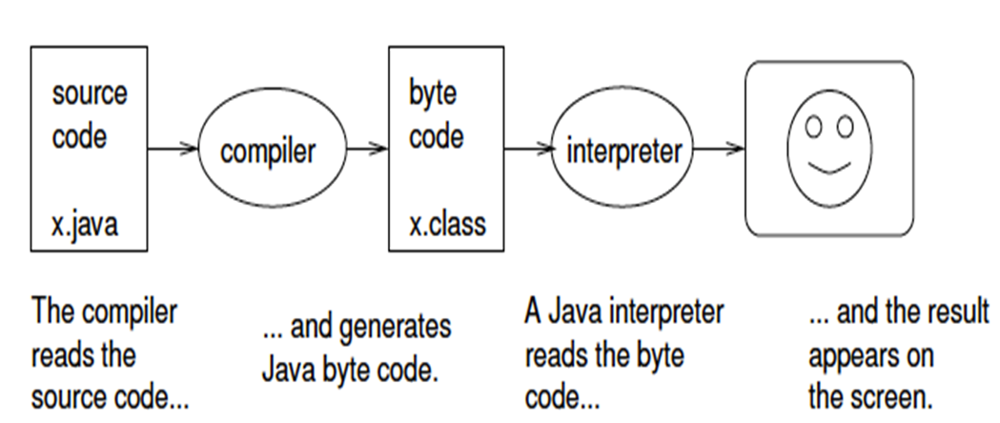

***
A program is a sequence of instructions that species how to perform a computation. The computation might be something mathematical, like solving a system of equations or finding the roots of a polynomial, but it can also be a symbolic computation, like searching and replacing text in a document.

Program call statements, which looks different in different programming languages, for instance in C++ we use ( cout …) to print something whereas we use in Java  ( println….) to perform the same.

#### Basic Operations in Java
- **input:** Get data from the keyboard, or a file, or some other device.   
- **output:** Display data on the screen or send data to a file or other device.    
- **math:** Perform basic mathematical operations like addition and multiplication.   
- **testing:** Check for certain conditions and run the appropriate sequence of statements.   
- **repetition:** Perform some action repeatedly, usually with some variation.
