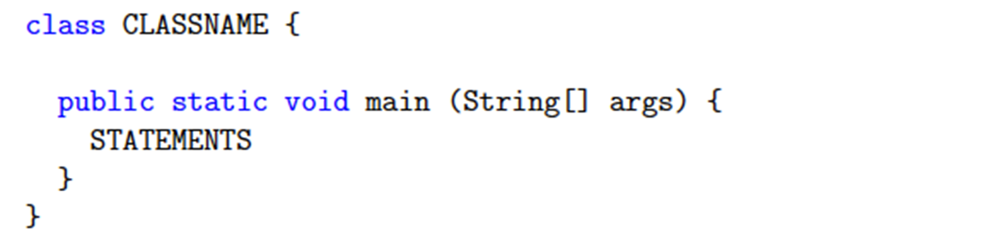

***
Every Java file (ends with the `.java` extension), and it should contain a **class definition inside with the same name.**  

Basic Java Program form:

#### If you want your Java file to do something, then you should place a `main` method inside that class.

Classes and methods must be defined within a **pair of curly braces { }.**

Place the lines you want your code to execute **inside the main method.**

The file you are seeing shows you the appropriate syntax of a simple Java program.

##### Note: Both the class name and the file name are called `JavaProgram`.

