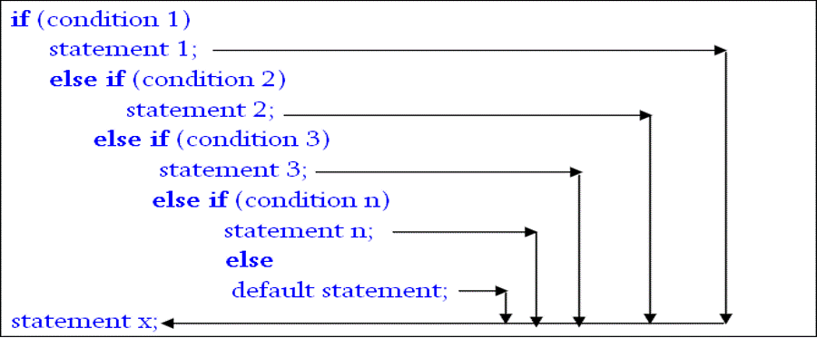
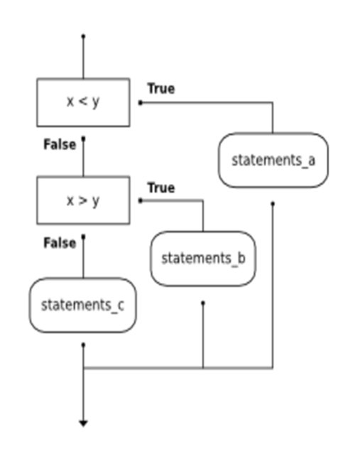

we have been checking for 2 conditions. Even or Odd. Positive or Negative.

What if there is more than 2 conditions?
#### Chained conditionals enable to choose from several conditions.
**if –else if ladder**      
We might get a situation where we need to check value multiple times to find exact matching condition.

#### How to check if any number is Positive, negative or Zero since (0) has no sign?
