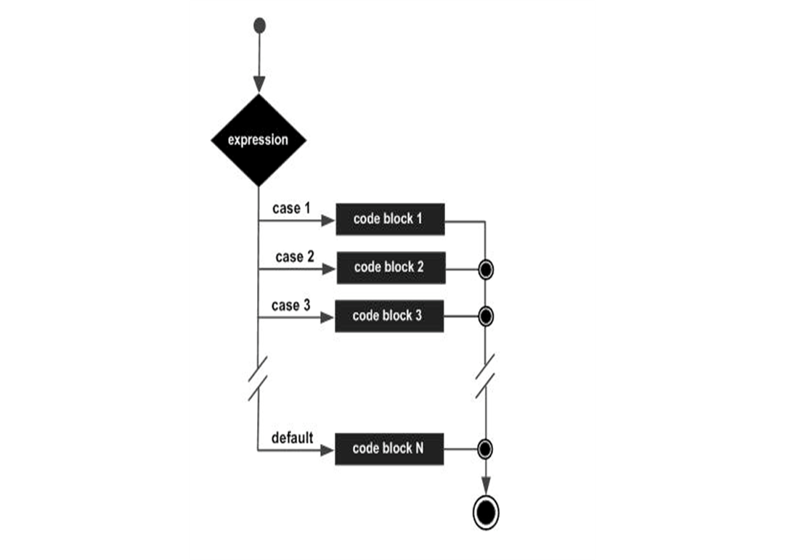

***
#### Unlike if and if else statements, the switch statement can have a number of possible execution paths.       
	A switch works with the int and char.  

Syntax:     
`switch(expression) {   
case value :       // Statements       
break;      
...     
default : // Optional       // Statements   
}`

**Flow Diagram**

#### Switch Syntax   
Each break statement terminates the enclosing switch statement.     
The break statements are necessary because without them, statements in switch blocks fall through: All statements after the matching case label are executed in sequence, regardless of the expression of subsequent case labels, until a break statement is encountered.       
The default statement is optional, but it must show up toward the finish of the switch.     
 
**The following example is a program displays the month corresponding to the integer month.**
